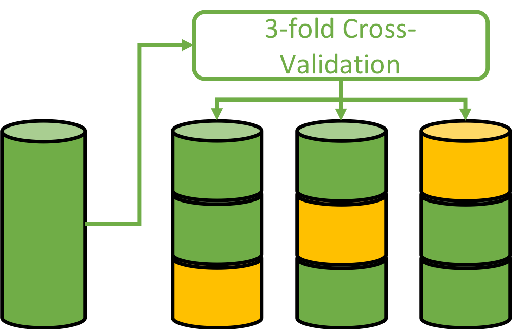
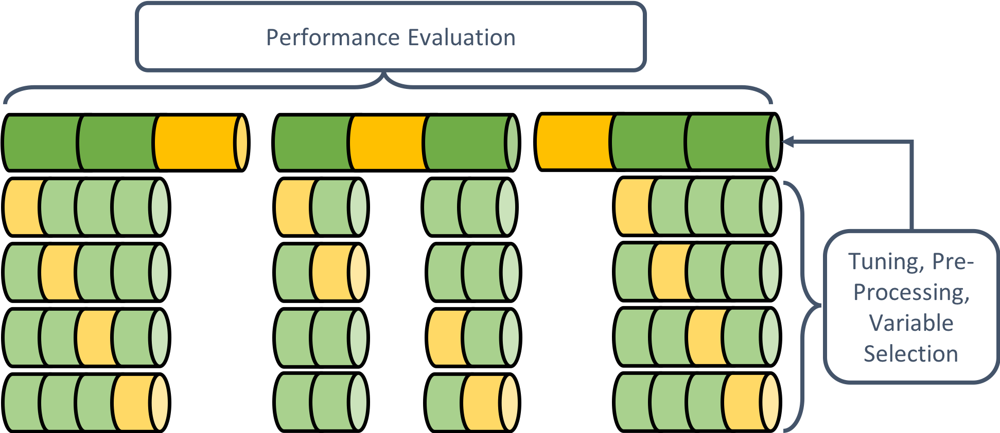
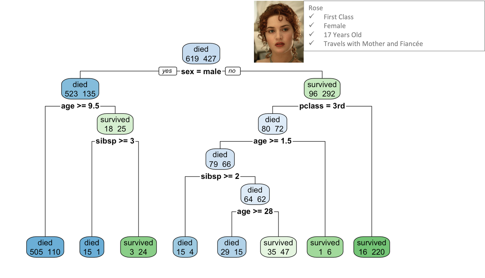
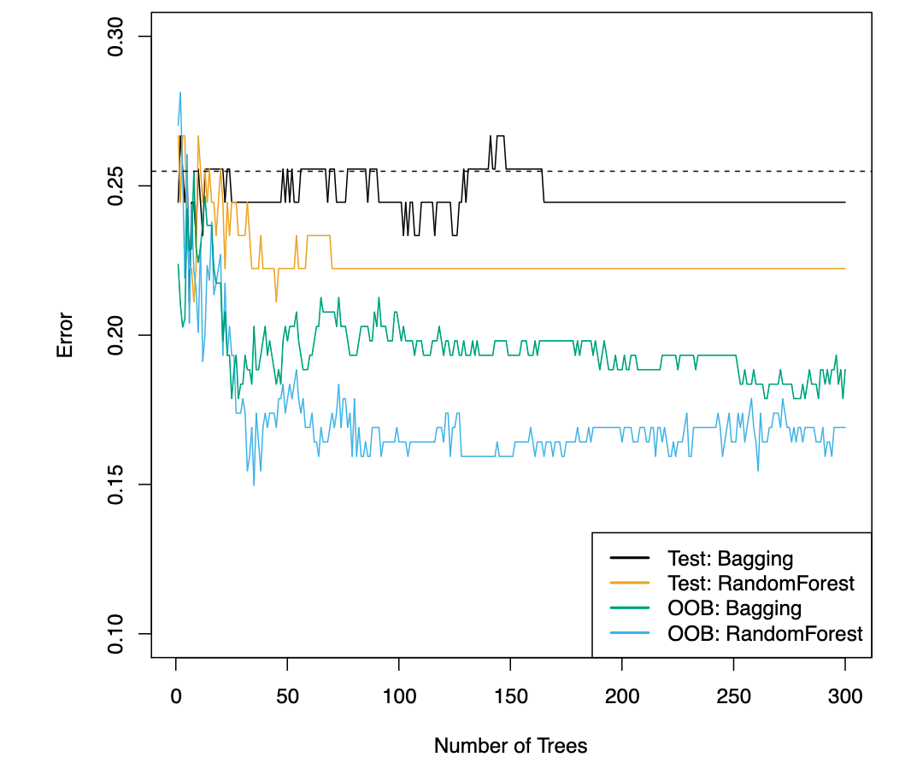
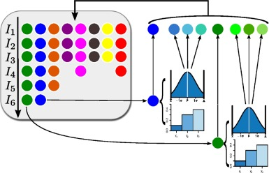
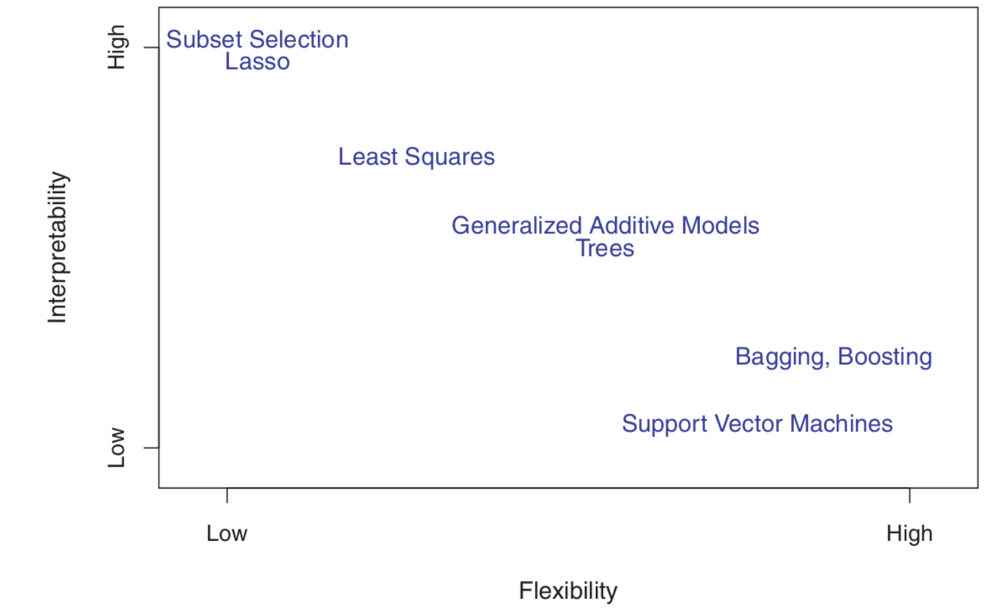

```{r setup, include=FALSE}
knitr::opts_chunk$set(echo = TRUE)
library(knitr)
library(kableExtra)
```

<style>

.notepaper {
  position: relative;
  margin: 30px auto;
  padding: 29px 20px 20px 45px;
  width: 680px;
  line-height: 30px;
  color: #6a5f49;
  text-shadow: 0 1px 1px ;
  background-color: #f2f6c1;
  background-image: -webkit-radial-gradient(center, cover, rgba(255, 255, 255, 0.7) 0%, rgba(255, 255, 255, 0.1) 90%), -webkit-repeating-linear-gradient(top, transparent 0%, transparent 29px, rgba(239, 207, 173, 0.7) 29px, rgba(239, 207, 173, 0.7) 30px);
  background-image: -moz-radial-gradient(center, cover, rgba(255, 255, 255, 0.7) 0%, rgba(255, 255, 255, 0.1) 90%), -moz-repeating-linear-gradient(top, transparent 0%, transparent 29px, rgba(239, 207, 173, 0.7) 29px, rgba(239, 207, 173, 0.7) 30px);
  background-image: -o-radial-gradient(center, cover, rgba(255, 255, 255, 0.7) 0%, rgba(255, 255, 255, 0.1) 90%), -o-repeating-linear-gradient(top, transparent 0%, transparent 29px, rgba(239, 207, 173, 0.7) 29px, rgba(239, 207, 173, 0.7) 30px);
  border: 1px solid #c3baaa;
  border-color: rgba(195, 186, 170, 0.9);
  -webkit-box-sizing: border-box;
  -moz-box-sizing: border-box;
  box-sizing: border-box;
  -webkit-box-shadow: inset 0 1px rgba(255, 255, 255, 0.5), inset 0 0 5px #d8e071, 0 0 1px rgba(0, 0, 0, 0.1), 0 2px rgba(0, 0, 0, 0.02);
  box-shadow: inset 0 1px rgba(255, 255, 255, 0.5), inset 0 0 5px #d8e071, 0 0 1px rgba(0, 0, 0, 0.1), 0 2px rgba(0, 0, 0, 0.02);
}

.notepaper:before, .notepaper:after {
  content: '';
  position: absolute;
  top: 0;
  bottom: 0;
}

.notepaper:before {
  left: 28px;
  width: 2px;
  border: solid #efcfad;
  border-color: rgba(239, 207, 173, 0.9);
  border-width: 0 1px;
}

.notepaper:after {
  z-index: -1;
  left: 0;
  right: 0;
  background: rgba(242, 246, 193, 0.9);
  border: 1px solid rgba(170, 157, 134, 0.7);
  -webkit-transform: rotate(2deg);
  -moz-transform: rotate(2deg);
  -ms-transform: rotate(2deg);
  -o-transform: rotate(2deg);
  transform: rotate(2deg);
}

.quote {
  font-family: Georgia, serif;
  font-size: 14px;
}

.curly-quotes:before, .curly-quotes:after {
  display: inline-block;
  vertical-align: top;
  height: 30px;
  line-height: 48px;
  font-size: 50px;
  opacity: .2;
}

.curly-quotes:before {
  content: '\201C';
  margin-right: 4px;
  margin-left: -8px;
}

.curly-quotes:after {
  content: '\201D';
  margin-left: 4px;
  margin-right: -8px;
}

.quote-by {
  display: block;
  padding-right: 10px;
  text-align: right;
  font-size: 13px;
  font-style: italic;
  color: #84775c;
}

.lt-ie8 .notepaper {
  padding: 15px 25px;
}

div.footnotes {
  position: absolute;
  bottom: 0;
  margin-bottom: 70px;
  width: 80%;
  font-size: 0.6em;
}
</style>

<script src="https://ajax.googleapis.com/ajax/libs/jquery/3.1.1/jquery.min.js"></script>
<script>
$(document).ready(function() {
  $('slide:not(.backdrop):not(.title-slide)').append('<div class=\"footnotes\">');

  $('footnote').each(function(index) {
    var text  = $(this).html();
    var fnNum = (index+1).toString();
    $(this).html(fnNum.sup());

    var footnote   = fnNum + '. ' + text + '<br/>';
    var oldContent = $(this).parents('slide').children('div.footnotes').html();
    var newContent = oldContent + footnote;
    $(this).parents('slide').children('div.footnotes').html(newContent);
  });
});
</script>

## This lecture

1. Resampling (Recap + Nested Resampling)
2. Hyperparameter Tuning
3. Model Classes
4. Benchmarking

# Resampling

## Recap: Cross-Validation (CV)

-   Random partitioning in $k$ equally sized parts (usually 5 or 10)
-   $k-1$ parts serve as training set, remaining fold is test set
-   Each part is used as the test set once
-   The estimated prediction error is averaged over all *folds*

## Cross-Validation (CV)

```{r, echo=FALSE}

```

## Repeated Cross-Validation (RCV)

- same as CV, but multiple runs with different seeds (e.g., $10 \times 10-$fold CV)
- different seeds = subset structures are different
- averaging performance estimates over repetitions stabilizes results (especially in combination with small sample sizes) and can be helpful when using them to perform a significance test (is model A better than model B) 

```{r, echo=FALSE}
Model_A = sample(350:600,100, replace = TRUE)/1000
Model_B = sample(300:500,100, replace = TRUE)/1000
boxplot(Model_A, Model_B, ylab = "MSE", xlab = "Model", main = "Significant Difference?")
```

## Nested Resampling

When tuning hyperparameters, a more complex resampling strategy is necessary:

- *inner resampling* is used to select hyperparameters and pre-process the data (select variables, impute missing data, scale variables, etc.)
- *outer resampling* is used to evaluate the full data analysis pipeline

This is necessary to obtain "fair", i.e., not overoptimisitc performance estimates

## Nested Resampling

```{r, echo=FALSE}

```

# Hyperparameter Tuning (Example: Tree-based Methods)

## Decision Trees

- Recursive binary splitting to find subsets that are homogeneous regarding outcome:

```{r, echo=FALSE, out.width="80%"}

```

## Random Forests

- Aggregation of multiple decision trees
- Combination of Bagging (Bootstrap Aggregation) and variable selection
- Ensemble of de-correlated deep trees promises better out-of-sample performance:

```{r, echo=FALSE, out.width="40%"}

```

## Hyperparameters of Random Forest

- Minimum node size in node to attempt a split
- Maximum tree depth
- Minimum impurity reduction
- Minumum number of observations in leaf nodes
- Number of trees
- Number of predictors considered for each split (often called *mtry*)

## Hyperparameters of Random Forest

- Although random forests usually work relatively well with default settings, tuning may be beneficial to improve accuracy (classification) or increase the precision (regression task)

- Remember: Tuning and selection of hyperparameters needs to be separated from performance evaluation (inner resampling strategy within modeling pipeline)!

## Hyperparamer Tuning - Grid Search

- Specify a grid of parameter values that should be considered during tuning:

```{r, echo=FALSE, out.width="50%"}
grid = expand.grid(mtry = c(10, 15, 20), ntrees = c(100, 250, 500))
kable(grid) %>% 
  kable_styling(latex_options="scale_down", font_size = 9)
```

- Every combination of hyperparameter settings is used to train a model and the performance of each model is evaluated on a test-set to determine the best parameter combination (again: this should be done in an inner loop to avoid overoptimistic performance evaluations for the overall modeling pipeline)

## Hyperparamer Tuning - Grid Search

```{r, echo=FALSE, out.width="50%"}
grid = expand.grid(mtry = c(10, 15, 20), ntrees = c(100, 250, 500))
grid$MSE = c(sample(400:600, 6)/1000, 0.322, sample(400:600, 2)/1000)
kable(grid) %>% 
  kable_styling(latex_options="scale_down", font_size = 9) %>%
  row_spec(7, bold = T, color = "red")
```

- Hyperparameter settings with the best performance metric (here: smallest MSE) are selected

## Hyperparamer Tuning - Random Search

- Easy to imagine that grid search is only feasible if few values for some selected hyperparameters are tested
- The computational demand increases drastically when many hyperparameters (see, for example, the XGBoost) should be optimized and many potential values (and their interactions) have to be evaluated:

    - Testing 20 values for 4 parameters results in 160,000 models that have to be trained
    
- Random search as an alternative with limited budget (can be more efficient, especially when some hyperparameters do not strongly impact the model performance)

## Hyperparameter Tuning - More Advandced Approaches

- Model-based/ Bayesian Optimization (MBO)
- (Generalized) Simulated Annealing
- Iterative Racing:

```{r, echo=FALSE, out.width="40%"}

```

## Tunability of Algorithms

Some ML algorithms are more strongly affected by hyperparameter settings than others - i.e., they have a higher tunability which means that have to tune the hyperparamters to obtain good predictions (Probst et al., 2019).

- the random forest is an example of a good "of the shelf algorithm"
- SVM requires careful tuning of kernel function
- XGBoost with many hyperparameters usually requires extensive tuning

# Benchmarks

## Which Model Should We Choose?

Contrary to classical statistical modeling, machine learning is usually used in a more exploratory and purely data-driven manner. That said, we do not know beforehand how the outcome is related to the predictors and therefore, we also do not know which algorithm is going to work best for a specific data set/ prediction task.

## Model Classes

- (Generalized) linear models + polynomial regression
- Generalized additive models (inter alia using splines)
- Support vector machines
- k-nearest-neighbors
- Tree-based methods (bagging, boosting)
- neural networks
- ...

## Flexibility-Interpretability Trade-Off

```{r, echo=FALSE, out.width="80%"}

```

## Which Model Should We Choose?

- Idea: Conducting a small benchmark experiment to compare different algorithms
- All models are trained on the same data (e.g., using the same folds in CV)
- Hyperparameter tuning should be "fair":

    - some algorithms are good off-the-shelf algorithms that work reasonably well with default parameters (e.g., random forests), while for other algorithms it is almost impossible to come up with appropriate defaults (e.g., support vector machines)
    - if one model is extensively tuned and another model is not, the question remains whether the model with highly optimized hyperparameters is actually better

- **Always** include a meaningful baseline for comparison, e.g., a *featureless learner* predicting the outcomes mean (regression task) or mode (classification task)

## Benchmark Studies

- Often a good idea to compare a linear model (e.g., LASSO) to one or more complex models
- If the more complex model does not outperform a simpler, more interpretable model, the latter is clearly favourable
- Sometimes it makes sense to look at different performance measures in a benchmark experiment:
   
    - e.g., while Model A shows the highest accuracy, Model B might be more sensitive (higher true positive rate/ recall) which could be preferable in a situation, where a rare event (e.g., a disease) should be predicted
    - sometimes a tie between two models regarding a primary outcome can be broken using a secondary performance metric
    
## ML in R - The mlr3verse

- So far, we have used different packages to train different models (e.g., rpart, ranger), *mlr3* provides an ecosystem with wrapper functions for the most common algorithms
- It also facilitates:

      - resampling (inner and outer resampling strategy) and performance evaluation
      - data pre-processing through graph-learners (i.e., creating a data analysis pipeline)
      - hyperparameter tuning with state-of-the-art tuning schemes
      (model-based optimization, iterative racing, etc.)
      - model comparisons via benchmarking
      - the implementation of cost-sensitive learning (e.g., Sterner, Pargent, & Goretzko, 2023)
      - model stacking
      - interpretable machine learning
      - visualization
      
## ML Benchmarks in mlr3

Create a task (i.e., what should be predicted and which data is used):

```{r, eval=FALSE}
# here classification task
task <- TaskClassif$new(id = "ID",
  backend = data, # data set
  target = "Outcome", 
  positive = "Positive Class") # only in binary classification task
```

Define resampling scheme (inner and outer resampling), e.g.,:

```{r, eval=FALSE}
# define resampling using pre-specified resampling concepts such as RCV and CV
res_outer <- rsmp("repeated_cv", repeats = 3, folds = 5)
res_inner <- rsmp("cv", folds = 5)
```

## ML Benchmarks in mlr3

Define tuning, if necessary:

```{r, eval=FALSE}
# define tuning, e.g., using random search with 1000 iterations
terminator <- trm("evals", n_evals = 1000)
tuner <- tnr("random_search")
```

Define performance measure for inner resampling, i.e., that is used to select hyperparemeter settings

```{r eval=FALSE}
# define inner performance measure, e.g., accuracy
mes_acc <- msr("classif.acc")
```

## ML Benchmarks in mlr3

Define algorithms (mlr3: learners) that should be tested:

```{r, eval=FALSE}
# define learners, use featureless learner as baseline;
# here: classical logistic regression (simple model), random forest ("ranger")
# and xgboost
baseline <- lrn("classif.featureless",  predict_type = "prob")
logreg <- lrn("classif.log_reg", predict_type = "prob")
ranger <- lrn("classif.ranger", predict_type = "prob")
xgboost <- lrn("classif.xgboost", predict_type = "prob")
```

## ML Benchmarks in mlr3 {.smaller}

Define hyperparameters that should be tuned and create modeling pipeline for learners whose hyperparameters need tuning:

```{r, eval=FALSE}
# Example: xgboost for which two hyperparameters are tuned:
param_set_xgb <- ps(
  nrounds = p_int(lower = 1, upper = 500),
  eta = p_dbl(lower = 0.001, upper = 0.01))

xgb_tuned <- AutoTuner$new(
  learner = xgboost, # basic xgboost learner (see above)
  resampling = res_inner, # inner resampling to evaluate different param sets
  measure = mes_acc, # performance measure to select parameters (see above)
  search_space = param_set_xgb, # parameter range that is tested
  terminator = terminator, # termination criterion
  tuner = tuner) # tuning scheme (here: random search)
# new id to find model in output 
# (necessary if multiple xgbs with different tuning schemes are evaluated) 
xgb_tuned$id <- "classif.xgboost.tuned" 
```

## ML Benchmarks in mlr3

Set up benchmark grid with all learners and tasks (here only one task, but theoretically you could benchmark different algorithms using different task which would be a benchmark experiment that rather focuses on the methodological differences of the algorithms and tested pipelines than the specific tasks)

```{r, eval=FALSE}
# Create benchmark grid defining the task(s), learners and the 
# resampling strategy used for performance evaluation (i.e., outer resampling)
grid <- benchmark_grid(tasks = list(task),
                       learners = list(baseline, logreg, ranger, xgb_tuned),
                       resamplings = list(res_outer)
                       )
```

Run the benchmark experiment

```{r, eval = FALSE}
results <- benchmark(grid)
```

## ML Benchmarks in mlr3 

Analyze results using different performance metrics, e.g., accuracy, sensitivity, and specificity as well as obtaining standard deviations for all metrics to get an idea of how stable/unstable the aggregated parameter estimates are:

```{r, eval = FALSE}
mes_list <- list(
  msr("classif.sensitivity"),
  msr("classif.sensitivity", id = "classif.sensitivity.sd", aggregator = sd),
  msr("classif.specificity"),
  msr("classif.specificity", id = "classif.specificity.sd", aggregator = sd),
  msr("classif.acc"),
  msr("classif.acc", id = "classif.acc.sd", aggregator = sd)
  )

results$aggregate(mes_list)
```

Quick visualization of the results:

```{r, eval = FALSE}
mlr3viz::autoplot(results, measure = msr("classif.acc"), type = "boxplot")
```

## ML Benchmarks in mlr3 

- Load the complete *mlr3verse* to get the full access to all wrapper functions for a variety of algorithms (*mlr3extralearners*), tools for visualizing results (*mlr3viz*), and many more (advanced) tools for conducting ML experiments in R:

    - Very convenient (all-in-one framework)
    - Easy to extend (S6 class)
    - Better control over train-test separation (avoid data leakage!)
    - most comprehensive ecosystem in R that is constantly updated

- More detailed descriptions and tutorials to deal with more advanced problems can be found under https://mlr3.mlr-org.com/ 

- Other popular frameworks include `tidymodels` (https://www.tidymodels.org/), `caret` (https://topepo.github.io/caret/), or `h2o` (https://cran.r-project.org/web/packages/h2o/index.html)
